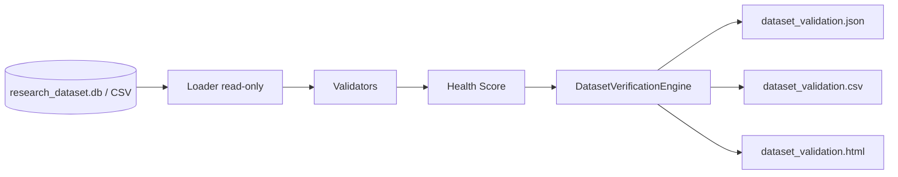

# Dataset Verification Engine

**Status:** Production module (read-only pre-Replay validation)  
**Does not modify:** Dataset Builder, Replay Engine, Analytics, BUY_V3, SELL_V6, Trade Validation, Signal Pipeline  
**Does not:** fix, interpolate, synthesize, or repair bars

---

## Architecture



---

## Files Created

| File | Role |
|------|------|
| `src/dataset_verification/calendar.py` | IST session + NSE holiday set |
| `src/dataset_verification/loader.py` | Read-only DB/CSV load |
| `src/dataset_verification/validators.py` | All 18 validation checks |
| `src/dataset_verification/health.py` | Health score + verdict |
| `src/dataset_verification/exporters.py` | JSON/CSV/HTML |
| `src/dataset_verification/engine.py` | Orchestrator |
| `src/dataset_verification/cli.py` | CLI |
| `src/dataset_verification/__init__.py` | Exports |
| `src/dataset_verification/__main__.py` | Module entry |
| `tests/test_dataset_verification_engine.py` | Unit tests |
| `dataset_verification_engine.md` | This document |

## Files Modified

**None.**

---

## CLI

```bash
python -m src.dataset_verification.cli --db data/datasets/research_dataset.db --out outputs/dataset_verification

python -m src.dataset_verification.cli --csv outputs/pipeline/NIFTY50_5m_pipeline.csv --out outputs/dataset_verification

python -m src.dataset_verification --db --symbol NSE:NIFTY50-INDEX --resolution 5
```

Exit codes: `0` score≥90, `2` score&lt;90, `1` error.

---

## Health Score

| Score | Verdict |
|------:|---------|
| 100 | Ready for Replay |
| ≥95 | Minor warnings |
| &lt;90 | Replay not recommended |

---

## Verification Steps

1. Load bars (DB or CSV) — no writes to source  
2. Run checks 1–17  
3. Compute checksum / hash / fingerprint  
4. Build coverage report  
5. Score health  
6. Export JSON + CSV + HTML  

---

## Integration with Replay

Run verification **before** Replay. If band is `BLOCK`, do not start Replay.  
Replay Engine is unchanged; it continues to consume CSV/DB exports independently.
