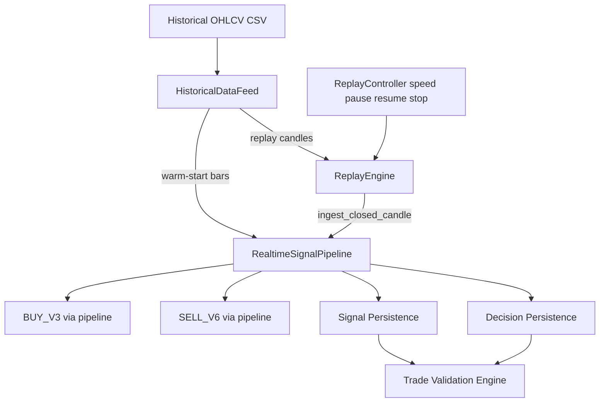

# Historical Replay Engine

**Status:** Production module  
**Scope:** Feed historical OHLCV through the **existing** Realtime Signal Pipeline  
**Non-goals:** Dashboards, analytics, strategy changes, duplicated signal engines

---

## 1. Architecture



**Critical rule:** Replay never imports or calls `BuyV3Engine` / `SellV6Engine`.  
Every candle enters via `RealtimeSignalPipeline.ingest_closed_candle()` → `_on_candle_close()` → `_handle_closed_candle()` — the same path used when a live 5m bucket closes.

---

## 2. Files Created

| File | Role |
|------|------|
| `src/replay/__init__.py` | Public exports |
| `src/replay/__main__.py` | `python -m src.replay` |
| `src/replay/data_feed.py` | `HistoricalDataFeed`, date windows |
| `src/replay/controller.py` | Pause / Resume / Stop / Speed |
| `src/replay/engine.py` | `ReplayEngine` orchestration |
| `src/replay/cli.py` | Replay CLI |
| `tests/test_historical_replay_engine.py` | Unit + integration tests |
| `historical_replay_engine.md` | This document |

## 3. Files Modified

| File | Change | Trading behaviour |
|------|--------|-------------------|
| `src/pipeline/realtime_signal_pipeline.py` | Added `warm_start_from_frame()` and `ingest_closed_candle()` | **Unchanged** — thin wrappers over existing `load_history` / `_on_candle_close` |

**Not modified:** BUY_V3, SELL_V6, Context Engine, Trade Validation Engine logic, Decision Persistence schema, Startup Optimization.

---

## 4. Replay CLI

```bash
python -m src.replay.cli --help
# or
python -m src.replay --help
```

| Mode | Flag | Example |
|------|------|---------|
| Single day | `--day` | `--day 2026-03-10` |
| Week | `--week` | `--week 2026-W11` |
| Month | `--month` | `--month 2026-03` |
| Custom range | `--from` + `--to` | `--from 2026-03-01 --to 2026-03-15` |

| Speed | Flag value |
|-------|------------|
| 1x | `--speed 1x` |
| 5x | `--speed 5x` |
| 10x | `--speed 10x` |
| 100x | `--speed 100x` |
| Unlimited | `--speed unlimited` (default) |

Pacing: delay between candles = `300s / speed` (5-minute bar duration). Unlimited = no sleep.

**Controls:** Ctrl+C → graceful `stop()` after current candle.

Programmatic pause/resume:

```python
engine.pause()
engine.resume()
engine.stop()
```

---

## 5. Example Command

```bash
python -m src.replay.cli --day 2026-03-10 --speed unlimited
```

```bash
python -m src.replay.cli --from 2026-03-01 --to 2026-03-05 --speed 100x \
  --signal-db data/paper/replay_signals.db \
  --validation-db data/paper/replay_trade_validation.db
```

---

## 6. Example Output

```text
[REPLAY] window=2026-03-10→2026-03-10 warm=1875 candles=75 speed=unlimited
[CANDLE CLOSED]
  timestamp=2026-03-10T09:15:00+05:30
...
[REPLAY] progress=50/75 (66.7%) last=2026-03-10T13:20:00+05:30 state=RUNNING
[REPLAY COMPLETE] {'window_start': '2026-03-10', 'window_end': '2026-03-10',
  'warm_start_bars': 1875, 'candles_fed': 75, 'state': 'COMPLETED',
  'decisions': 75, 'signals': 2, 'validations': 2, ...}
[REPLAY] state=COMPLETED candles=75 signals=2 decisions=75 validations=2
```

---

## 7. Verification Strategy

| Check | How |
|-------|-----|
| Same entry path as live | `ingest_closed_candle` → `_on_candle_close` → `_handle_closed_candle` (unit spy test) |
| No direct engine calls | AST test: `src/replay/*` must not import `buy_v3` / `sell_v6` |
| Warm-start before window | Bars `< start` loaded via `warm_start_from_frame` (same `context.load_history`) |
| Replay bars only once | Only window candles fed through `ingest_closed_candle` |
| Persistence | Decisions + signals written by existing pipeline; Trade Validation polls same DB |
| Existing tests | Pipeline / trade-validation suites remain green |

**Identity claim:** For any closed candle `C`, live and replay both execute `_handle_closed_candle(C)`. Signal scores, verdicts, and persistence therefore follow identical code.

---

## 8. Proof BUY_V3 / SELL_V6 / Signal Engine Unchanged

1. **No edits** to `src/signals/buy_v3.py`, `src/signals/sell_v6.py`, scoring, thresholds, or market context evaluation logic.
2. Pipeline change is **additive only**:
   - `warm_start_from_history()` now delegates to `warm_start_from_frame(tail)` — same `load_history` call as before.
   - `ingest_closed_candle()` is a one-line call to `_on_candle_close()`.
3. Replay imports `RealtimeSignalPipeline` only — engines are reached exclusively through the pipeline’s existing `evaluate_latest()` / `to_signal()` path.
4. Automated tests assert routing and forbid direct engine imports in `src/replay/`.
