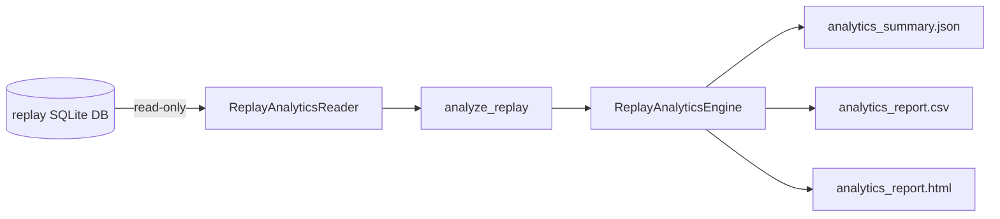

# Replay Analytics Engine

**Status:** Production module (read-only post-replay reporting)  
**Does not modify:** BUY_V3, SELL_V6, Signal Pipeline, Replay Engine, Trade Validation Engine

---

## Architecture



Reads `signal_decisions`, `signals`, and `candles` only. Never calls signal engines.

---

## Files Created

| File | Role |
|------|------|
| `src/replay_analytics/__init__.py` | Package exports |
| `src/replay_analytics/reader.py` | Read-only SQLite access |
| `src/replay_analytics/analyzer.py` | Summary / stats / daily / monthly |
| `src/replay_analytics/exporters.py` | JSON / CSV / HTML writers |
| `src/replay_analytics/engine.py` | Orchestrator |
| `src/replay_analytics/cli.py` | CLI |
| `src/replay_analytics/__main__.py` | `python -m src.replay_analytics` |
| `tests/test_replay_analytics_engine.py` | Unit + integration tests |
| `replay_analytics_engine.md` | This document |

## Files Modified

**None.**

---

## CLI

```bash
python -m src.replay_analytics.cli --db data/paper/replay_smoke.db --out outputs/replay_analytics
```

```bash
python -m src.replay_analytics --db data/paper/replay_signals.db --out outputs/replay_analytics
```

Defaults:
- `--db` → `data/paper/replay_smoke.db`
- `--out` → `outputs/replay_analytics`

Outputs (fixed names in `--out`):
- `analytics_summary.json`
- `analytics_report.csv`
- `analytics_report.html`

---

## Report Contents

1. Replay Summary — window, candles, decisions, BUY/SELL/NO_TRADE  
2. Decision Statistics — percentages  
3. Score Statistics — avg/max buy & sell scores  
4. Rule Statistics — top rejections, top passed rules, rule frequency  
5. Market Statistics — trend, regime, VWAP (inferred from `VWAP_MISMATCH`), HTF  
6. Daily Summary  
7. Monthly Summary  
8. CSV export  
9. HTML report  

**VWAP note:** Pass/Fail is inferred from absence/presence of `VWAP_MISMATCH` in persisted `reason_codes` (column not stored separately).
