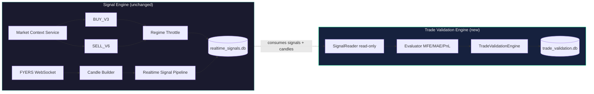

# Trade Validation Engine

**Status:** Production module (post-signal analytics only)  
**Scope:** Objective evaluation of generated BUY/SELL signals — **never influences signal generation**

---

## 1. Architecture Diagram



**Separation principle:** The validation engine reads from `realtime_signals.db` in **read-only** mode. It writes only to a separate `trade_validation.db`. No hooks in `RealtimeSignalPipeline`.

---

## 2. Database Schema

### Source (read-only): `data/paper/realtime_signals.db`

| Table | Used fields |
|-------|-------------|
| `signals` | `id`, `timestamp`, `direction`, `entry`, `accepted`, `raw_json` |
| `signal_decisions` | `timestamp`, `symbol`, `buy_score`, `sell_score`, `reason_codes` |
| `candles` | `symbol`, `timestamp`, `open`, `high`, `low`, `close` |

**No schema changes** to the signal-engine database.

### Validation store: `data/paper/trade_validation.db`

```sql
CREATE TABLE trade_validations (
    id                      INTEGER PRIMARY KEY AUTOINCREMENT,
    source_signal_id        INTEGER NOT NULL UNIQUE,  -- signals.id (logical FK)
    signal_timestamp        TEXT NOT NULL,
    symbol                  TEXT NOT NULL,
    direction               TEXT NOT NULL,            -- BUY | SELL
    entry_price             REAL NOT NULL,
    signal_score            REAL,                   -- buy_score or sell_score
    reason_codes            TEXT NOT NULL,          -- JSON array
    next_candle_close       REAL,
    next_3_candle_close     REAL,
    next_5_candle_close     REAL,
    window_high             REAL,
    window_low              REAL,
    mfe                     REAL NOT NULL,
    mae                     REAL NOT NULL,
    target_price            REAL NOT NULL,
    stop_price              REAL NOT NULL,
    target_pct              REAL NOT NULL,
    stop_pct                REAL NOT NULL,
    target_hit              INTEGER NOT NULL,
    stop_hit                INTEGER NOT NULL,
    pnl                     REAL,
    outcome                 TEXT NOT NULL,          -- WIN | LOSS | OPEN | EXPIRED
    holding_bars            INTEGER,
    exit_reason             TEXT NOT NULL,          -- TARGET_HIT | STOP_HIT | WINDOW_EXPIRED | OPEN
    evaluation_window_bars  INTEGER NOT NULL,
    exit_timestamp          TEXT,
    evaluated_at            TEXT NOT NULL,
    updated_at              TEXT NOT NULL
);

CREATE TABLE validation_state (
    key   TEXT PRIMARY KEY,
    value TEXT NOT NULL
);
```

---

## 3. Files Created

| File | Purpose |
|------|---------|
| `src/trade_validation/__init__.py` | Public exports |
| `src/trade_validation/config.py` | Configurable window, target %, stop % |
| `src/trade_validation/models.py` | `SignalRecord`, `CandleBar`, `TradeValidationResult` |
| `src/trade_validation/evaluator.py` | Pure forward evaluation (MFE/MAE/PnL/outcome) |
| `src/trade_validation/signal_reader.py` | Read-only signal DB consumer |
| `src/trade_validation/storage.py` | Validation DB persistence |
| `src/trade_validation/engine.py` | Orchestrator + CLI (`python -m src.trade_validation.engine`) |
| `tests/test_trade_validation_engine.py` | Unit + integration tests |
| `trade_validation_engine.md` | This document |

---

## 4. Files Modified

**None.** Signal engine, pipeline, market context, startup optimization, and `realtime_signals.db` schema are untouched.

---

## 5. Signal Lifecycle

```text
1. CLOSED CANDLE
   RealtimeSignalPipeline evaluates BUY_V3 / SELL_V6
   → writes signals + signal_decisions + candles to realtime_signals.db

2. SIGNAL GENERATED (accepted or rejected)
   Row inserted in signals table with entry, direction, raw evaluation

3. VALIDATION POLL (separate process)
   TradeValidationEngine.run_once()
   → SignalReader.fetch_signals_after_id()
   → SignalReader.fetch_forward_candles()  (strictly after signal timestamp)
   → evaluate_signal() computes MFE/MAE/PnL/outcome
   → TradeValidationDatabase.upsert_validation()

4. OPEN REFRESH
   OPEN validations re-evaluated each cycle until WIN/LOSS/EXPIRED

5. ANALYTICS
   Query trade_validation.db for win rate, expectancy, MFE/MAE distributions
```

---

## 6. Example Evaluation Record

```json
{
  "source_signal_id": 42,
  "signal_timestamp": "2026-07-16 10:00:00+05:30",
  "symbol": "NSE:NIFTY50-INDEX",
  "direction": "BUY",
  "entry_price": 25000.0,
  "signal_score": 85.0,
  "reason_codes": ["FORMULA_COMPLETE"],
  "next_candle_close": 25065.0,
  "next_3_candle_close": 25080.0,
  "next_5_candle_close": 25095.0,
  "window_high": 25110.0,
  "window_low": 24985.0,
  "mfe": 110.0,
  "mae": 15.0,
  "target_price": 25060.0,
  "stop_price": 24990.0,
  "target_pct": 0.24,
  "stop_pct": 0.04,
  "target_hit": true,
  "stop_hit": false,
  "pnl": 60.0,
  "outcome": "WIN",
  "holding_bars": 1,
  "exit_reason": "TARGET_HIT",
  "evaluation_window_bars": 20,
  "exit_timestamp": "2026-07-16 10:05:00+05:30"
}
```

---

## 7. Example WIN

| Field | Value |
|-------|-------|
| Direction | BUY |
| Entry | 25000 |
| Target (0.24%) | 25060 |
| Forward bar 1 | High 25070 → **TARGET_HIT** |
| Outcome | **WIN** |
| PnL | +60 pts |
| MFE | 70 |
| Holding | 1 bar |

---

## 8. Example LOSS

| Field | Value |
|-------|-------|
| Direction | BUY |
| Entry | 25000 |
| Stop (0.04%) | 24990 |
| Forward bar 1 | Low 24980 → **STOP_HIT** (checked before target) |
| Outcome | **LOSS** |
| PnL | −10 pts |
| MAE | 20 |

---

## 9. Example OPEN Trade

| Field | Value |
|-------|-------|
| Direction | BUY |
| Entry | 25000 |
| Evaluation window | 20 bars |
| Forward bars available | 2 |
| Price action | No target/stop touch |
| Outcome | **OPEN** |
| Exit reason | OPEN |
| PnL | null (not yet closed) |
| next_candle_close | 25005 |
| next_3_candle_close | null |

Re-evaluated on each `run_once()` cycle until the window fills or target/stop is hit.

---

## 10. Configuration

```python
from src.trade_validation import TradeValidationConfig, TradeValidationEngine

config = TradeValidationConfig(
    evaluation_window_bars=20,   # 20 × 5m = 100 minutes
    target_pct=0.24,             # ~60 pts on NIFTY 25000
    stop_pct=0.04,               # ~10 pts on NIFTY 25000
    evaluate_rejected_signals=True,
)
engine = TradeValidationEngine(config)
engine.run_once()
engine.close()
```

CLI: `python -m src.trade_validation.engine`

---

## 11. Verification — No Trading Behaviour Changed

| Check | Result |
|-------|--------|
| `src/signals/buy_v3.py` | Unmodified |
| `src/signals/sell_v6.py` | Unmodified |
| `src/pipeline/realtime_signal_pipeline.py` | Unmodified |
| `src/pipeline/market_context_service.py` | Unmodified |
| `src/storage/sqlite.py` schema | Unmodified |
| Existing pipeline tests | Pass |
| New validation tests | Pass (isolated module) |

The validation engine is a **downstream consumer only**. It cannot alter BUY/SELL/NO_TRADE decisions because it has no write path to the signal engine and no import from pipeline hot path.

---

## 12. Future Integration

| Phase | Integration |
|-------|-------------|
| Paper trading | `src/paper_trading/trade_manager.py` may orchestrate fills using validation metrics |
| Live trading | Same read-only contract; swap candle source to live DB |
| Analytics | Dashboard queries `trade_validation.db` for MFE/MAE/win-rate by score bucket |
